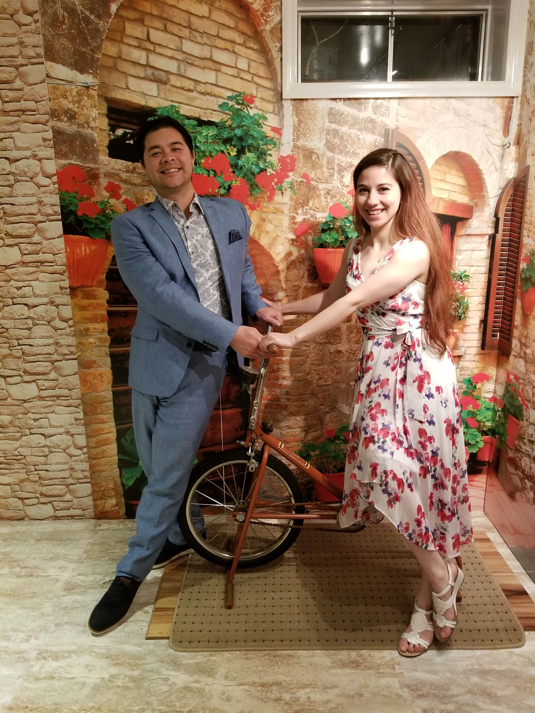

# Vaccination
The health and safety of all attendees is important to us.  
We request that all guests are fully vaccinated against COVID-19.
Make sure to get tested a few days before the wedding and travel safely.

# Ceremony Itinerary
- Processional
- Words of Welcome
- Poetry Reading
- Exchange of Vows
- Exchange of Rings
- Pronouncement
- Ceremonial Demonstration
- Final words
- Recessional

# Wedding Party
### these words, in this order

#### Father of the Bride
Yury Arakelov

#### Father of the Groom
Gerald Brooks

#### Mother of the Bride
Lela Kirtadze

#### Mother of the Groom
Judy Lawley

#### Officiant
- Jacob Evan Solomon ESQ: Presiding, practicing prerogative of praxis, platonist

#### Bridesmaids
- Marine Kurdadze, ESQ: Maid of honor, Benevolent renaissance woman, the unstoppable, ever loveable supermom
- Elaine To, PhD: Modern day explorer of scientific truths in the biological world
- Rena Lee: On a journey to protect our Earth for generations to come
- Suchita Lal: Master of jest, dance, the feline spirit, and invaluable life lessons
- Salome Khelashvili: Philanthropic virtuoso and utter cool cat
- Ekaterina Stomakhina: Mysterious femme fatale on a journey to awaken the force within
- Luna Wang: Zealous social butterfly, determined to explore the globe

#### Groomsmen
- Danny Wong: Best man, peregrine potentate, puissant paragon, and plauditory pard
- Matthew Merrifield: Prestigious parser, purloiner, and producer of packages
- Brian Cairl: Perspicacious prodigy of punctilious perplexors, and template tradesman
- Joseph Wong: Pulchritudinous convoy, curate, and confidant to rambunctious rascals
- Christopher Wong: Tenacious troubadour, preux chevalier, boisterous bootstrapper
- Agraj Jain: Paladin of perceptrons, protean pollyanna, pantologist with panache
- Bilal Gill: Phlogisticated fastidious phenom, and pilose piece de resistance

### formatted like this

# Locations
All events and lodging are co-located at  
[1100 South Ave, Staten Island, NY 10314](https://goo.gl/maps/7SmsbWwxsfS6uxTx9)

Cocktails at Brittons Oak Room  
Reception at the Tea House Garden  
After Party at Lorenzo's Restaurant  

A more detailed map can be found [here](https://nicotrasballroom.com/tea-house-garden/).

# Menu
For those of you worried about being peckish, don't be!
There will be plenty of food at the cocktail hour and reception.

## Cocktail hour

<strong>Open Bar</strong> 
<strong>Passed Hors d'oeuvres</strong> 
<strong>Tuscan Table</strong> 
<strong>Salumeria</strong> 
<strong>International Cheeses</strong> 
<strong>Carving Station</strong> 
<strong>Pasta Station</strong> 
<strong>French Regional Station</strong> 
<strong>Eastern Seaboard Station</strong> 

## Reception

<strong>Open Bar</strong> 
<strong>Salad</strong> 
Baby Arugula, Radicchio, Fennel, Prosciutto, Fresh Mozzarella, Tomatoes, White Balsamic 
<strong>Pasta</strong> 
Gemelli, Creamy Pesto, Sundried Tomato and Artichokes 
<strong>Choice of Entree</strong> 
Boneless Braised Short Rib of Beef, Wild Mushroom Bordelaise Sauce 
Seared Chicken with Artichoke, Spinach, Fontina Cheese, Tomato Cream Sauce 
Crispy Branzino, Maderia Wine Truffle Reduction 
<strong>Wedding Cake</strong> 
<strong>Dessert Sampler</strong>

Please come ready to feast and indulge in libation.

Those of you who have dietary restrictions will have options available,
but notifying us ahead of time will help prepare the venue in advance.
You will still need to inform the waiters of your restrictions when ordering your entree.

All meat is halal.

# Attire
Dashing as we all are in our skinny jeans, we request that guests attend in semi-formal or festive attire. What are those attires? [This article has some guidelines](https://www.brides.com/story/wedding-dress-code-explained) but at a glance

Or in other words  

Guests are encouraged to wear
- Necktie or bow tie
- Suit jacket or blazer
- Dress pants or slacks
- Dress shoes or loafers
- Midi, Maxi, Cocktail dresses
- Pantsuits or jumpsuits
- Heels, flats, or sandals
- Classic color combinations or vibrant flair

Guests are discouraged from wearing
- T-shirts
- Jeans
- Sneakers
- White or floor length dresses
- Anything that prevents you from dancing

But ultimately, we just want people to dress up a little.
It's a fun party and we want everyone to look sharp.

# Photo Album
While we would appreciate no phones during the ceremony,
we would love it if people captured those special moments during the cocktail
hour and reception. It would be wonderful if people could

#### Upload to this Google Photo Album https://photos.app.goo.gl/YAiyuvyqSTo6kNZC8  

so we could all share them.

